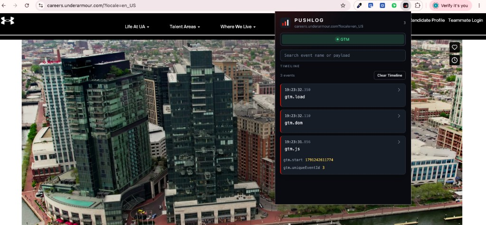

<p align="center">
  
</p>

<h1 align="center">Pushlog</h1>

<p align="center">
  A Chrome extension that shows what a page is sending to Adobe Analytics, the AEP Web SDK, and Google Tag Manager, in a clean timeline, without opening DevTools.
</p>

<p align="center">
  
  
  
</p>

<p align="center">
  
</p>

## Why it exists

Checking a tag usually means opening DevTools, filtering the console or the network tab, and rebuilding the payload by hand. On a live site that fires Adobe and Google tags together, that gets noisy. A lot of those hits also leave before the console is open.

Pushlog records the pushes as they happen and shows them in the toolbar. DevTools can stay closed.

## What it records

| Source | What Pushlog listens for |
| --- | --- |
| Adobe Client Data Layer | `adobeDataLayer.push()` |
| AEP Web SDK | `alloy("sendEvent")` |
| Google Tag Manager | `dataLayer.push()` and `gtag()` |

When a page uses more than one, the popup shows a toggle for each source it finds. The timeline filters to the one you pick.

## What you can do with it

- Read a newest-first timeline of the event name, the time, and the payload
- Open nested objects as folders instead of one collapsed JSON blob
- Search by event name or by anything inside the payload
- Clear the timeline for the current tab
- Keep capturing after the page replaces `push` itself, which Adobe and Google Tag Manager both do while they start up

Callback functions pushed as listeners are skipped. Those are not analytics hits, and Pushlog does not call them.

## How it is built

The data layer lives in the page's own JavaScript. A normal content script cannot see it, so Pushlog installs a small hook in that world at `document_start`, before the tag manager boots. Each event is checked and forwarded into the extension. A background worker stores one timeline per tab. The popup is a React app.

The hook wraps `push` instead of replacing the array. When Adobe or Google Tag Manager assigns its own `push` during startup, that new function is wrapped too, and the original is always called. The same object is recorded once, so a replay of the startup queue does not show up as a second hit.

Each tab keeps the latest 2,000 events. Payloads larger than 50 KB are truncated. Closing the tab clears its timeline.

## Stack

Chrome Manifest V3, TypeScript, React, Vite, Tailwind CSS, and Vitest.

It runs in Chrome and other Chromium browsers: Edge, Brave, Arc, and Opera. Chrome 111 or newer.

## Run it locally

Node.js 20 or newer, and Chrome 111 or newer.

```bash
npm install
npm run build
```

1. Open `chrome://extensions`.
2. Turn on **Developer mode**.
3. Choose **Load unpacked** and select the `dist` folder.
4. Reload the site you want to inspect.
5. Open Pushlog from the toolbar.

`npm run dev` rebuilds while you work. Leave it running, load `dist` once, and reload the extension after larger changes.

`npm run demo` serves a sample page at http://localhost:4173 with a few Adobe data layer events you can push by hand.

`npm test` covers the page hooks, the per-tab store, and search.

## Layout

```
src/content/inject.ts                 installs the page hooks
src/content/patchAdobeDataLayer.ts    Adobe Client Data Layer
src/content/patchWebSdk.ts            AEP Web SDK
src/content/patchGoogleTagManager.ts  Google Tag Manager and gtag
src/content/content.ts                forwards events into the extension
src/background/background.ts          one timeline per tab
src/popup/                            React timeline
demo/index.html                       sample page
```

---

<p align="center">
  Built by <a href="https://www.khalifcooper.dev">Khalif Cooper</a>
</p>
